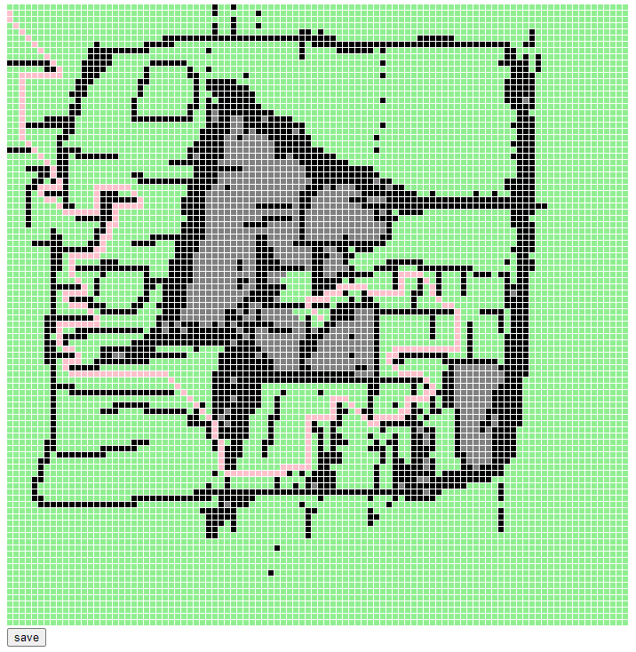
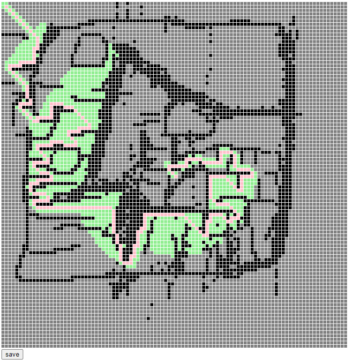

# 每周总结可以写在这里

## 异步编程

### 红绿灯问题

- setTimeout
- promise
- generator
- async await

```javascript
function* g(){
	yield 1;
	yield 2;
	yield 3;
}
for(v of g()){
	console.log(v);
}

async function* g(){
	let i = 0;
	while(true) {
		await sleep(1000);
		yield i++;
	}
}
for await(let v of g()){
	console.log(v)
}
```

### 寻路问题

- 绘制画板
- 广度优先搜索
- 深度优先搜索
- A\* (A-Star)
- (启发式算法)





## 正则表达式

- match
- replace
- exec
- lastIndex

```js
var source = `
    function sleep(t) {
        return new Promise(function (resolve) {
            setTimeout(resolve, t);
        });
    }
`;
var regexp = /(function|new|return)|([ \t\n\r]+)|([a-zA-Z][a-zA-Z0-9]*)|([\(\)\{\}\,\;])/g;

var dictionary = ["keywords", "whitespace", "identifier", "punctuator"];

var token = null;
var lastIndex = 0;

var container = document.getElementById("container");

do {
  lastIndex = regexp.lastIndex;
  token = regexp.exec(source);
  if (!token) break;
  console.log(lastIndex, token[0]);
  let text = document.createElement("span");
  text.textContent = token[0];

  for (let i = 1; i < 5; i++) {
    if (token[i]) {
      text.classList.add(dictionary[i - 1]);
    }
  }
  container.appendChild(text);
} while (token);
```

